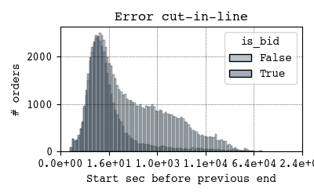
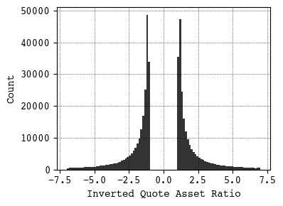

# Motivation

I am making a lot of plots everyday. But I found that I have a preference over the style. Sometimes I have to make repeative config for every plot that I make. Such as, `plt.tight_layout`, `plt.figure(figsize=(4, 3))`. I got tired of this. 
I found out that all these can be automated by setting a config file! So this drives me create a style that I like so that I can enjoy more the plot creation process.

# How to use it? 

For matplotlib, just copy the file to `~/.matplotlib/matplotlibrc` and you are good to go.

An example of the plot:

